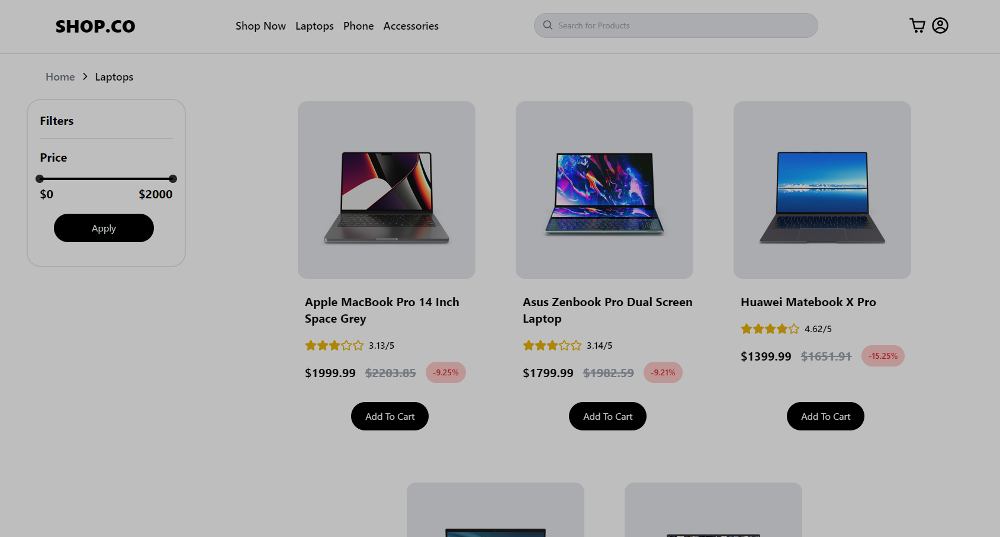

# Shop Co

An e-commerce platform for electronic products such as laptops, mobile phones, and more. Shop Co offers a comprehensive shopping experience with user authentication, product search, add-to-cart functionality, detailed product pages, and filtering options.

## Technologies Used

- **React**: A JavaScript library for building user interfaces.
- **TypeScript**: Adds static typing to JavaScript, helping to catch errors early.
- **Tailwind CSS**: A utility-first CSS framework for designing responsive layouts.
- **Redux Toolkit**: For state management, making it easier to manage the application's state.
- **Vite**: A fast build tool for modern web projects.

## Features

- **User Authentication:** Secure user login and registration system.
- **Product Search:** Search functionality to find products easily.
- **Add to Cart:** Add products to the shopping cart and view the cart details.
- **Product Pages:** Full product pages with detailed information, including images, specifications, and pricing.
- **Filtering:** filtering options to sort products price range.
- **Responsive Design:** Optimized for both desktop and mobile devices.

## Demo

Check out the live version of the project here: [Shop Co](https://shopco.vercel.app/).

## Screenshots

Add screenshots to showcase the interface and functionality of your project. For now, here are some placeholders:




## Installation

To set up the project locally, follow these steps:

1. **Clone the repository:**

```bash
git clone https://github.com/Sherifjrr/ecommerce-app
```

2. **Navigate to the project directory:**

```bash
cd ecommerce-app
```

3.**Install dependencies:**

```bash
npm install
```

4.**Start the development server:**

```bash
npm run dev
```

## License

[MIT](https://choosealicense.com/licenses/mit/)

## Contact Information

For any inquiries or suggestions, feel free to reach out:

[Portfolio](https://sherifjrr.vercel.app/)
